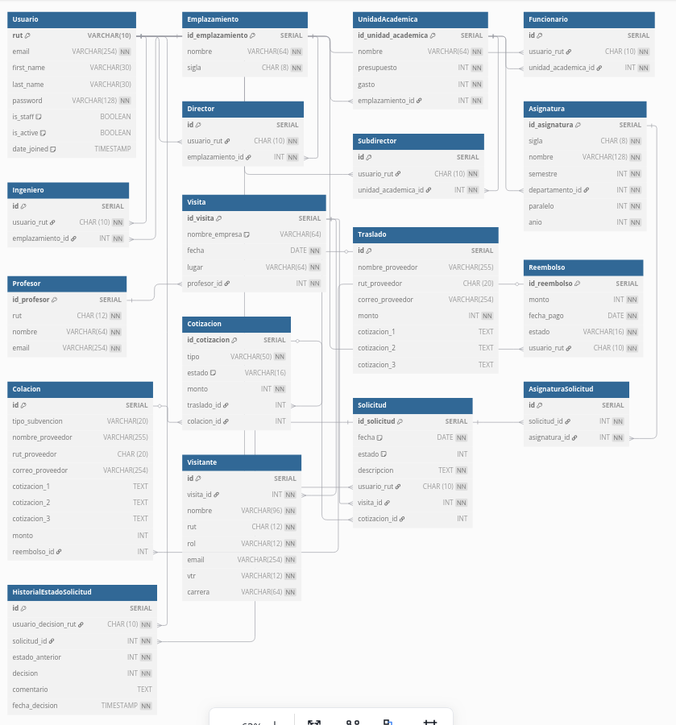

VIND, integrantes: 

* Sofía Ramírez  -  202273008-0
* Marco Repetto - 202103059-K

# BBDD



# Aspectos técnicos

## Requisitos

- Docker
- Docker Compose

## Estructura del Proyecto

- `backend/`: Contiene el código del backend en Python utilizando FastAPI.
- `frontend/`: Contiene el código del frontend en JavaScript utilizando React.
- `db/`: Contiene los scripts de inicialización de la base de datos.
- `docker-compose.yml`: Archivo de configuración para Docker Compose.

## Despliegue

Sigue los siguientes pasos para desplegar el proyecto:

1. **Clonar el repositorio:**

   ```sh
   git clone https://gitlab.com/mixedpaipo/grupo03-2024-proyinf
   cd grupo03-2024-proyinf
   ```

2. **Construir y levantar los servicios con Docker Compose:**

   ```sh
   docker-compose up --build
   ```

   Esto construirá las imágenes de Docker para el frontend, backend y la base de datos, y levantará los contenedores correspondientes.

3. **Acceder a la aplicación:**

   - Frontend: [http://localhost:3000](http://localhost:3000)
   - Backend: [http://localhost:8000](http://localhost:8000)

> **⚠️ Warning:** En caso de no funcionar el frontend, sobre el contenedor del frontend, ejecute el siguiente comando:
> 
> ```bash
> npm install
> ```

> **⚠️ Warning:** En caso de no funcionar el backend, reconstruir los contenedores.

4. **Poblar la base de datos.**

   Creamos una nueva terminal y accedemos al contenedor del backend con el siguiente comando
   ```sh
   docker exec -it grupo03-2024-proyinf-backend-1 /bin/bash
   ```
   y ejecutamos
   ```sh
   python poblar_bd.py
   ```
Esto poblará la base de datos
## Endpoints del Backend

Los Endpoints del Backend se pueden encontrar [aquí](https://gitlab.com/mixedpaipo/grupo03-2024-proyinf/-/wikis/Servicios)

## Variables de Entorno

El archivo `docker-compose.yml` define las siguientes variables de entorno para el servicio de backend:

- `DATABASE_URL`: URL de conexión a la base de datos PostgreSQL.

## Scripts de Inicialización de la Base de Datos

Los scripts de inicialización de la base de datos se encuentran en el directorio `db/` y se ejecutan automáticamente cuando se levanta el contenedor de PostgreSQL.

## Notas Adicionales

- Asegúrate de tener los puertos `3000`, `8000` y `5432` disponibles en tu máquina local.
- Puedes modificar los archivos de configuración según tus necesidades específicas.
- Para acceder a los distintos Dashboard es importante crear una cuenta y logearse con esos datos. o tomar prestado alguno de los datos creados por `python poblar_bd.py`
- Los [estados](https://gitlab.com/mixedpaipo/grupo03-2024-proyinf/-/issues/9) de las rendiciones son: Pendiente, Aprobada, Por devolver, Devuelta, Rechazada.
- El modelo de la base de datos se puede encontrar [aquí](https://gitlab.com/mixedpaipo/grupo03-2024-proyinf/-/issues/5)
